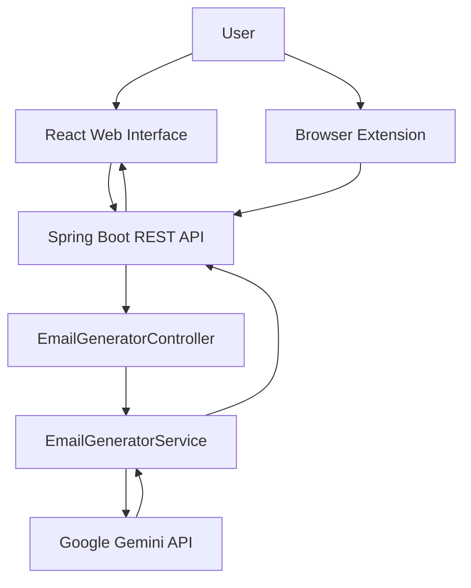

# ✉️ MailEase

### AI-Powered Email Reply Assistant

MailEase is an AI-powered email reply assistant that helps users generate clear, professional, and context-aware email responses in seconds.

Built with **React**, **Spring Boot**, and **Google Gemini**, MailEase provides a simple interface for generating replies based on the original email and the selected communication tone.

---

## ✨ Features

- 🤖 **AI-Powered Reply Generation**
  - Generate email replies using Google Gemini.

- 🎯 **Multiple Communication Tones**
  - Professional
  - Casual
  - Friendly

- 🧠 **Context-Aware Generation**
  - Uses the original email content as context while generating the response.

- ✍️ **Prompt-Based Response Control**
  - Generates concise and relevant replies without unnecessary details or subject lines.

- 📋 **One-Click Copy**
  - Copy the generated response directly to the clipboard.

- ⚡ **REST API Backend**
  - Spring Boot backend handles email generation requests and communicates with Gemini.

- 🌐 **React Web Interface**
  - Simple and intuitive interface for interacting with the application.

- 🧩 **Browser Extension**
  - Includes a browser extension module for email-assistant integration.

---

## 🏗️ Architecture



### Request Flow

```text
User
  │
  ▼
React Web Interface / Browser Extension
  │
  │  POST /api/email/generate
  ▼
Spring Boot REST API
  │
  ▼
EmailGeneratorController
  │
  ▼
EmailGeneratorService
  │
  ▼
Google Gemini API
  │
  ▼
Generated Email Reply
  │
  ▼
Frontend
```

---

## 🛠️ Tech Stack

| Category | Technologies |
|----------|--------------|
| Frontend | React, Vite, JavaScript, HTML, CSS |
| Backend | Java, Spring Boot, Spring Web, Spring WebFlux |
| AI | Google Gemini API |
| API | REST |
| Build Tool | Maven |
| Browser Integration | Browser Extension |
| Utilities | Lombok |
| Development | IntelliJ IDEA, VS Code |
| Version Control | Git, GitHub |

---

## 📁 Project Structure

```text
MailEase/
│
├── email-writer-ext/
│   └── Browser extension implementation
│
├── email-writer-react/
│   └── React + Vite frontend
│
├── email-writer-sb/
│   └── Spring Boot backend
│
├── hello-world-ext/
│   └── Extension development/testing module
│
├── email-writer-sb.zip
│   └── Backend project archive
│
└── README.md
```

---

## 🔄 How It Works

### 1. Enter Email Content

The user enters the original email content into the MailEase interface.

### 2. Select a Tone

The user selects the desired communication style:

- Professional
- Casual
- Friendly

### 3. Generate Reply

The frontend sends the email content and selected tone to the Spring Boot backend.

### 4. Backend Processing

The Spring Boot REST API receives the request and passes it to the email generation service.

### 5. AI Generation

The backend builds a structured prompt and sends it to the Google Gemini API.

### 6. Response Processing

The generated response is extracted from the Gemini API response.

### 7. Display & Copy

The generated reply is displayed in the frontend and can be copied with one click.

---

## 🔌 API

### Generate Email Reply

**Endpoint**

```http
POST /api/email/generate
```

### Request

```json
{
  "emailContent": "Hi Kaif, Could you please share the latest project update?",
  "tone": "professional"
}
```

### Response

```text
Thank you for reaching out. I would be happy to provide
an update on the project.
```

### Supported Tones

```text
professional
casual
friendly
```

---

## ⚙️ Configuration

MailEase keeps Gemini API configuration outside the source code using environment variables.

### Environment Variables

```text
GEMINI_URL=<your-gemini-api-url>
GEMINI_KEY=<your-gemini-api-key>
```

The Spring Boot application reads these values through:

```properties
gemini.api.url=${GEMINI_URL}
gemini.api.key=${GEMINI_KEY}
```

### 🔐 Security

API credentials should never be hard-coded or committed to a public repository.

Keep sensitive values in environment variables and make sure API keys are excluded from version control.

```text
Application
    │
    ├── Application Code
    ├── API Configuration
    │
    └── No API Secret
             │
             ▼
      Environment Variables
```

---

## 🧪 Example

### Original Email

```text
Hi Kaif,

I wanted to follow up regarding the project update.
Could you please share the current status?

Thanks,
Rahul
```

### Selected Tone

```text
Professional
```

### Generated Reply

```text
Hi Rahul,

Thank you for reaching out regarding the project update.
I will be happy to provide the current status and keep
you informed of any relevant developments.

Best regards,
Kaif
```

---

## 🖥️ Application Preview

### Web Interface

The MailEase interface provides:

- Original email input
- Tone selection
- Reply generation
- Generated response display
- Copy-to-clipboard functionality

> Screenshots and demo media can be added here.

---

## 🚀 Getting Started

### Prerequisites

Make sure the following are installed:

- Java
- Maven
- Node.js
- npm
- Git

A Google Gemini API key is also required.

### 1. Clone the Repository

```bash
git clone https://github.com/Md-Kaif-coder/MailEase.git
cd MailEase
```

### 2. Configure Gemini API

Set the required environment variables:

```text
GEMINI_URL=<your-gemini-api-url>
GEMINI_KEY=<your-gemini-api-key>
```

### 3. Start the Backend

```bash
cd email-writer-sb
mvn spring-boot:run
```

The Spring Boot backend runs on:

```text
http://localhost:8080
```

### 4. Start the Frontend

Open a new terminal:

```bash
cd email-writer-react
npm install
npm run dev
```

The React development server will typically run at:

```text
http://localhost:5173
```

---

## 📌 Current Status

### Implemented

- [x] React web interface
- [x] Spring Boot REST API
- [x] Google Gemini API integration
- [x] AI email reply generation
- [x] Tone selection
- [x] Context-aware prompt generation
- [x] Copy-to-clipboard functionality
- [x] Environment-based API configuration
- [x] Browser extension module

### Planned Improvements

- [ ] Gmail API integration
- [ ] Additional tone options
- [ ] Reply length control
- [ ] Email summarization
- [ ] Reply history
- [ ] Improved error handling
- [ ] Authentication
- [ ] Rate limiting
- [ ] Automated testing
- [ ] Dockerization
- [ ] Cloud deployment

---

## 🧠 Key Learning Areas

Building MailEase provided practical experience with:

- Spring Boot REST API development
- React and Vite
- Frontend–backend integration
- WebClient for external API communication
- Google Gemini API integration
- Prompt engineering
- JSON request and response handling
- Environment-based configuration
- Browser extension development
- Git and GitHub

---

## 🔮 Future Vision

MailEase can evolve from an email reply generator into a broader AI-powered email assistant.

Potential capabilities include:

```text
                    MailEase
                       │
        ┌──────────────┼──────────────┐
        ▼              ▼              ▼
   Generate Reply   Summarize     Improve Draft
        │              │              │
        └──────────────┼──────────────┘
                       ▼
                Smarter Email
                Communication
```

The goal is to reduce repetitive email-writing work while keeping responses clear, relevant, and professional.

---

## 📄 License

This project is licensed under the MIT License.

---

## 👨‍💻 Author

**Md. Kaif**

BTech Computer Science & Engineering

GitHub: [@Md-Kaif-coder](https://github.com/Md-Kaif-coder)

---

<p align="center">
  <strong>✉️ MailEase</strong>
  <br>
  Write less. Reply smarter.
</p>
